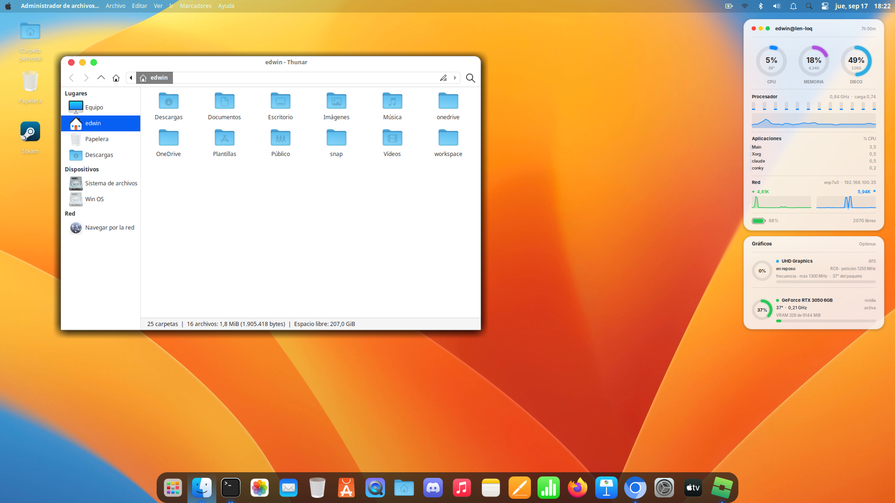

# xfce-theme-macos-ventura

macOS Ventura para XFCE: tema, dock, menú global de aplicaciones y monitor de
recursos. Con un instalador que no rompe tu configuración y un comando para
activarlo y desactivarlo cuando quieras.



## Qué incluye

- **Tema WhiteSur** (GTK, bordes de ventana y cursores) en variante clara y oscura
- **Panel superior** con la manzana y el **menú global** de aplicaciones
- **Dock** con iconos de macOS (plank)
- **Monitor de recursos** en conky: dos tarjetas translúcidas, sistema y gráficos
- Fondos de Ventura y, opcionalmente, el lanzador **Launchpad**

## Requisitos

XFCE 4.18 o superior en sesión **X11**, sobre una distribución basada en Debian.
Probado en Xubuntu 26.04 con XFCE 4.20.

En Wayland no funcionan el dock, el tema de xfwm4 ni el menú global.

## Instalación

```bash
git clone git@github.com:edronald7/xfce-theme-macos-ventura.git
cd xfce-theme-macos-ventura
./scripts/install.sh                    # instala, sin activar nada todavía
./scripts/install.sh --with-lightpad    # además compila el Launchpad
```

Instala las dependencias con apt, descomprime temas e iconos en tu perfil y deja
el comando `macos-theme` en `~/.local/bin`. Con `--no-deps` se salta apt.

## Uso

| Orden | Qué hace |
|---|---|
| `macos-theme apply` | Activa el tema (oscuro) |
| `macos-theme apply --light` | Variante clara |
| `macos-theme remove` | Restaura exactamente lo que tenías antes |
| `macos-theme status` | Estado actual |

Antes del primer `apply` se guarda tu configuración en
`~/.local/share/ventura-xfce/backup/`: valores de xfconf, panel, dock, terminal y
CSS. `remove` los devuelve tal cual, así que puedes alternar entre este tema y el
tuyo sin miedo.

## Desinstalación

```bash
./scripts/uninstall.sh          # restaura y borra lo instalado
./scripts/uninstall.sh --purge  # además quita los paquetes apt
```

## Estructura

| Carpeta | Contenido |
|---|---|
| `scripts/` | `install.sh`, `uninstall.sh` y el comando `macos-theme` |
| `conky/` | Monitor de recursos: configuración y dibujo en Lua/Cairo |
| `gtk/`, `cursors/` | Temas, iconos y cursores WhiteSur |
| `config/`, `dock/` | Panel de XFCE y accesos del dock |
| `wallpapers/` | Fondos de Ventura |
| `lightpad/` | Launchpad (opcional, se compila aparte) |

## Detalles que conviene saber

- El **menú global** solo aparece en las aplicaciones abiertas después de
  activarlo: reinícialas o vuelve a entrar en la sesión. Las que usan GTK4 o
  libadwaita no tienen barra de menús que mostrar.
- La ficha de **GPU** lee el estado por sysfs y solo consulta `nvidia-smi` si la
  tarjeta ya está despierta, para no gastar batería en portátiles Optimus.
- El monitor usa la tipografía **Inter** si está instalada y `Noto Sans` si no.
- Las tarjetas del monitor se dibujan por debajo de las ventanas; cambia `below`
  por `above` en `conky/ventura.conf` si las quieres siempre visibles.

## Qué aporta este repositorio

Partimos del trabajo de [ibm-7094a](https://github.com/ibm-7094a/ventura-xfce),
que dejó de mantenerse en 2024. Sobre esa base, aquí se añadió:

- **Instalador y desinstalador** en lugar de la lista de órdenes manuales del
  original, corrigiendo las rutas quemadas de otros usuarios, la extracción de
  los temas fuera de `~/.themes`, el `sudo` sobre `~/.config` y el nombre de tema
  inexistente al que apuntaban los XML.
- **Comando `macos-theme`**: activa y desactiva a demanda, con copia de
  seguridad y restauración exacta de lo que tenías. No hace falta cerrar sesión.
- **Menú global funcionando**: el panel ya traía el plugin, pero nadie encendía
  `Gtk/Modules` ni `ShellShowsMenubar`, así que salía siempre vacío.
- **Dock configurado de verdad**: plank 0.11 lee su configuración de GSettings e
  ignora `~/.config/plank/dock1/settings`, por lo que el tema del dock nunca se
  aplicaba y quedaba autoocultándose.
- **Monitor de recursos** nuevo, dibujado en Cairo: anillos, gráficas
  suavizadas, barras por hilo, batería y una ficha de GPU integrada y dedicada.
- **Compatibilidad** verificada con XFCE 4.20 y Xubuntu 26.04, y solo se aplican
  los XML de aspecto: los de monitores, atajos, energía y sesión ya no se pisan.

## Créditos

Basado en [ventura-xfce](https://github.com/ibm-7094a/ventura-xfce) de
ibm-7094a, bajo licencia MIT.

- [WhiteSur GTK](https://github.com/vinceliuice/WhiteSur-gtk-theme),
  [iconos](https://github.com/vinceliuice/WhiteSur-icon-theme) y
  [cursores](https://github.com/vinceliuice/WhiteSur-cursors) — vinceliuice (GPL-3.0)
- [Lightpad](https://github.com/libredeb/lightpad) — libredeb (GPL-3.0)
- [BigSurIcons](https://bigsuricons.webflow.io/)

## Licencia

Las aportaciones de este repositorio (`scripts/`, `conky/` y la documentación)
se publican bajo la **Apache License 2.0** — ver [LICENSE](LICENSE).

El material de terceros conserva su licencia original (MIT, GPL-3.0) y los
iconos de macOS pertenecen a Apple Inc.; el detalle está en [NOTICE](NOTICE).

Apple, macOS y Ventura son marcas registradas de Apple Inc. Este proyecto no
está afiliado a Apple Inc. ni respaldado por ella.
